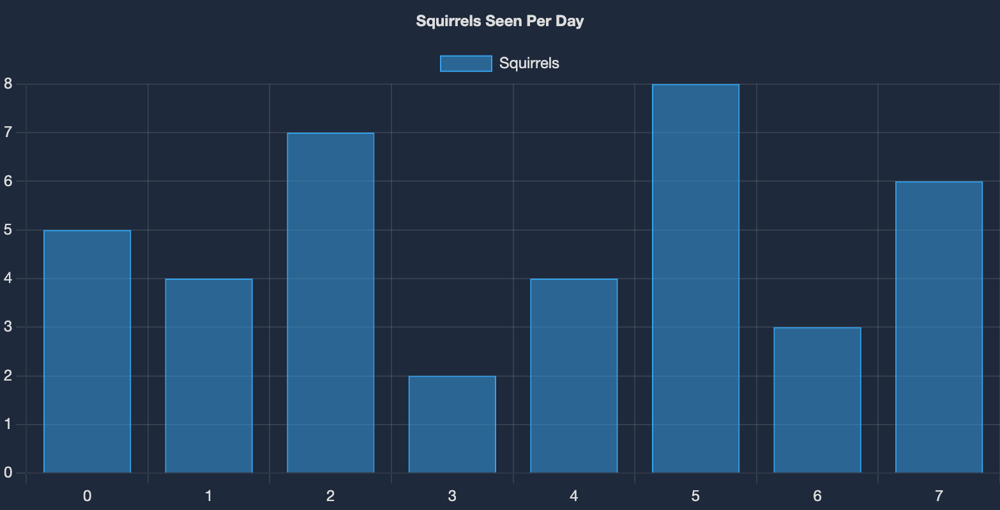
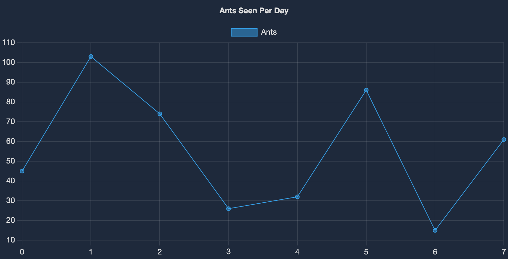
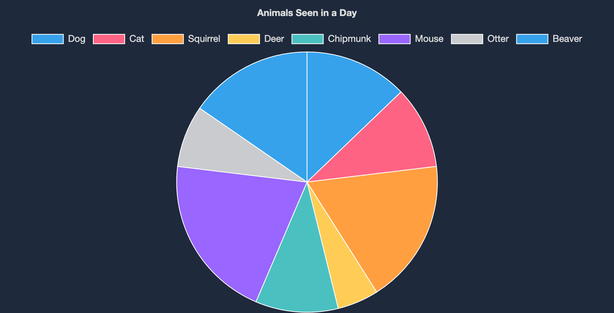

# goldmark-chart
Goldmark extension for static charts using Chart.JS. Uses the [Markviz](https://markvis.js.org/#/) format.

# Usage
```go
goldmark.New(
	goldmark.WithExtensions(
    &GoldmarkChart{}),
).Convert(src, dst)
```

The generated HTML must be included in a page with Chart.JS loaded. For example:
```html
<script type="text/javascript"
		src="https://cdnjs.cloudflare.com/ajax/libs/Chart.js/4.5.0/chart.umd.min.js"></script>
```

# Examples
~~~markdown
```vis
  layout: bar
  height: 400px
  title: Squirrels Seen Per Day
  label: Squirrels
  data: [
    { key: 0, value: 5 },
    { key: 1, value: 4 },
    { key: 2, value: 7 },
    { key: 3, value: 2 },
    { key: 4, value: 4 },
    { key: 5, value: 8 },
    { key: 6, value: 3 },
    { key: 7, value: 6 }
  ]
```
~~~



~~~markdown
```vis
  layout: line
  height: 400px
  title: Ants Seen Per Day
  label: Ants
  data: [
    { key: 0, value: 45 },
    { key: 1, value: 103 },
    { key: 2, value: 74 },
    { key: 3, value: 26 },
    { key: 4, value: 32 },
    { key: 5, value: 86 },
    { key: 6, value: 15 },
    { key: 7, value: 61 }
  ]
```
~~~



~~~markdown
```vis
  layout: pie
  radius: 150
  height: 400px
  title: Animals Seen in a Day
  data: [
    { key: "Dog", value: 5 },
    { key: "Cat", value: 4 },
    { key: "Squirrel", value: 7 },
    { key: "Deer", value: 2 },
    { key: "Chipmunk", value: 4 },
    { key: "Mouse", value: 8 },
    { key: "Otter", value: 3 },
    { key: "Beaver", value: 6 }
  ]
```
~~~

